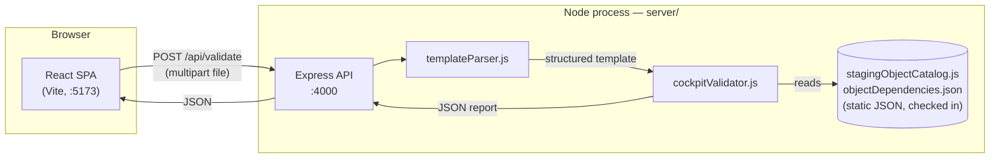
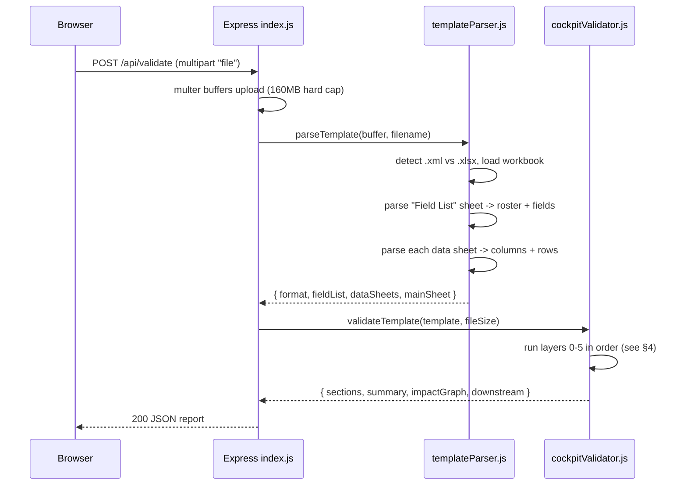
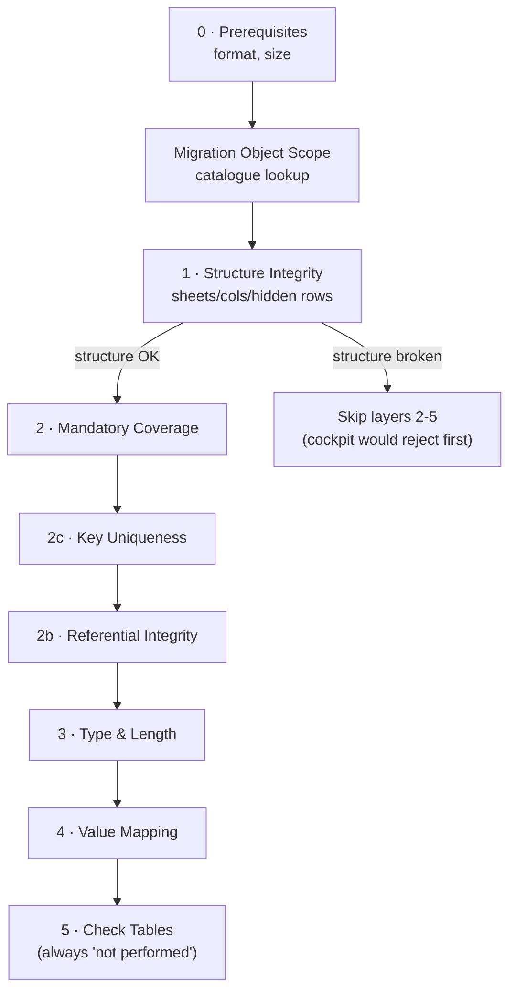
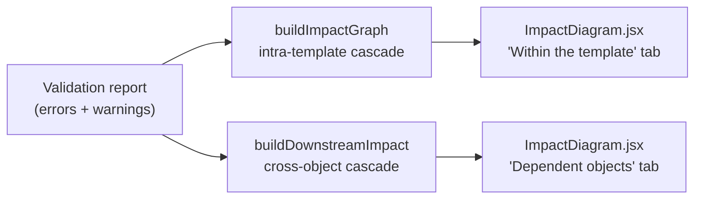

# Architecture

A handoff reference for whoever picks this project up next. Read this alongside
[CLAUDE.md](../CLAUDE.md) (the short version) and [REFERENCES.md](REFERENCES.md)
(where every scraped fact and design decision came from). This document is about
**how the pieces fit together and why** — the mental model, not a file listing.

---

## 1. What this is, in one paragraph

A user uploads a filled-in SAP S/4HANA Migration Cockpit template (a spreadsheet
SAP itself generates, in XML Spreadsheet 2003 format). The tool re-derives the
template's own schema from a sheet inside it called `Field List`, then runs the
data through the same categories of checks the real Cockpit would run when you
click Upload — before you've spent the round-trip actually uploading it. No SAP
connection, no config files describing "what a Product template looks like" —
the template describes itself, and the code just knows how to read that
description.

---

## 2. System overview



Two independent npm projects (`client/`, `server/`), no shared code, no
database. `Vite` proxies `/api/*` to Express in dev (see
`client/vite.config.js`) so the browser only ever talks to one origin.

**Nothing is persisted.** Each upload is parsed, validated, and returned in one
request. There's no session, no database, no stored history — refresh the page
and the report is gone. If you're asked to add "save my past validations,"
that's a genuinely new capability, not a bug.

---

## 3. Request lifecycle



If `parseTemplate` throws (unreadable file) or finds no `Field List` sheet,
`index.js` returns 400/422 immediately — the validator never runs on
unparseable input.

---

## 4. The validation pipeline

Everything lives in `cockpitValidator.js`, driven by one function:
`validateTemplate(template, fileSize)` (bottom of the file). It builds a
`Report` — a bag of `{ section, severity, message, location }` entries — by
calling each layer in a fixed order:



That short-circuit at Structure is deliberate and mirrors the real Cockpit: a
malformed file gets rejected at parse time, so there's no point reporting "row
9 has an invalid date" on a workbook whose columns don't even match its own
Field List.

| # | Function | What it checks | Can block downstream layers? |
|---|---|---|---|
| 0 | `checkPrerequisites` | Must be XML Spreadsheet 2003, ≤100MB | No |
| — | `checkMigrationObject` | Object name matched against the 228-object Staging Table catalogue | No |
| 1 | `checkStructure` | Sheets/columns/hidden technical rows match the Field List exactly | **Yes** |
| 2 | `checkMandatoryCoverage` | Every "active" row has all its mandatory fields filled | No |
| 2c | `checkKeyUniqueness` | No two active records share the same identity, per sheet | No |
| 2b | `checkReferentialIntegrity` | Main-sheet key resolves; child-sheet FKs point at real headers | No |
| 3 | `checkTypesAndLengths` | Text/Number/Date/Time conform to the declared type spec | No |
| 4 | `checkValueMapping` | Flags Text/80 columns needing source→target mapping; flags spelling-variant duplicates | No |
| 5 | `checkConfigTables` | Always reports "not performed" — needs a live SAP connection | No |

**Layer numbering has gaps on purpose** (2c sits between 2 and 2b). That's
historical — 2b (referential integrity) existed first, uniqueness checking was
carved out of it into its own layer later, and the numbers were kept
stable rather than renumbered, since they're also the section keys the
frontend renders under (`report.sections.keyUniqueness`, etc.). If you add a
new layer, give it a similarly-placed letter suffix rather than reflowing
everything.

### 4.1 Key uniqueness — the one layer with situational logic

`checkKeyUniqueness` (via `identityColumnsFor`) doesn't use one rule for every
sheet, because the template doesn't declare the same thing for every sheet:

- **Main sheet**: the Field List marks one column `group: 'Key'` — that's a
  real, declared primary key. Checked for uniqueness on its own.
- **Child sheets**: the `Key` group marker there only tags the *foreign key*
  back to the header. The rest of a child record's composite key isn't
  declared anywhere in the template. So the check falls back to **all
  mandatory columns** on that sheet as a stand-in identity. This is a
  *superset* of the true key — a match is always a genuine duplicate, but two
  rows differing only in a mandatory *data* field (not part of the real key)
  won't be caught. That's a deliberate bias toward never accusing a clean
  file, at the cost of occasionally missing a real duplicate.

If you're asked to tighten that (catch the missed case), the composite key
would need to come from somewhere the template doesn't currently declare it —
that's a real design gap, not an oversight to quietly "fix."

### 4.2 Downstream of validation: two impact graphs

Two extra computations run after the main pipeline, both **read-only against
the report** — they never add Errors, only annotate:



- **`buildImpactGraph`** answers: *if this main-sheet record failed, which
  child rows in this same file can't load because of it?* The cockpit loads
  headers before children, so a failed header blocks every child row pointing
  at it — even a child row that is itself perfectly valid.
- **`buildDownstreamImpact`** answers a completely different question: *if
  this whole migration object has any blocking error, which **other**
  migration objects (Material BOM, Sales Order, ...) can't be migrated because
  they list this one as a prerequisite?* It's a breadth-first walk over
  `objectDependencies.json`'s `requiredBy` map — see §5.

Both feed `ImpactDiagram.jsx` on the client, which renders one as an SVG
cascade and the other as a dependency fan-out, plus a Mermaid export for
pasting into tickets.

---

## 5. Where the static data comes from

`stagingObjectCatalog.js` (228 migration objects) and `objectDependencies.json`
(632 prerequisite edges between them) are **not hand-maintained** — they're
scraped from the SAP Help Portal by `server/scripts/fetch-object-dependencies.js`
and checked into git as plain data files. The scraper hits an internal
JSON endpoint (`help.sap.com/http.svc/pagecontent?...`) because the public page
is a client-rendered SPA that returns nothing useful to a plain HTTP fetch.

If SAP changes their documentation structure, re-run the scraper — don't
hand-edit the JSON files. Full provenance, including the exact endpoint and
why edges are resolved by page ID rather than object name, is in
[REFERENCES.md §2](REFERENCES.md).

---

## 6. Parsing: the part most likely to bite you

`templateParser.js` turns a workbook into `{ format, fieldList, dataSheets,
mainSheet }`. It supports two input shapes:

- **`.xml`** (XML Spreadsheet 2003) via `fast-xml-parser` — this is the format
  the real Cockpit requires, and the one with sharp edges (see below).
- **`.xlsx`** via `exceljs` — accepted so problems surface early, but always
  flagged as a blocking prerequisite error, since the Cockpit itself rejects
  it.

### 6.1 Two bugs already found the hard way — don't reintroduce them

Both only showed up against a genuine Excel **File → Save As → XML
Spreadsheet 2003** export; a hand-built or converter-generated XML file didn't
trigger either one, which is exactly why they shipped unnoticed for a while.

1. **Merged cells are sparse in real Excel output.** A banner row spanning
   8 columns has exactly **one** `<Cell>` element with `ss:MergeAcross="8"` —
   the other 8 columns have no cell at all, not an empty one. Code that
   assumes "the value is duplicated across the merged span" will silently see
   blanks. `worksheetFromSpreadsheetML`'s row/column index resolution
   (`ss:Index` jumps) exists specifically to handle this — don't bypass it
   with a simpler positional read.

2. **Header text newlines are `&#10;` entities, not literal `\n`.** Row 8 of
   every data sheet embeds a field's description below its name, e.g.
   `"Product Number*\n\nA key that uniquely identifies..."`. `fast-xml-parser`
   needs `htmlEntities: true` in its constructor options to decode that; without
   it, `parseHeaderCell`'s `str.split('\n')[0]` returns the *entire* blob as
   the field name, and nothing matches the Field List roster. This is
   currently set correctly in `loadWorkbook` — if you ever touch that
   `XMLParser` constructor call, keep it.

### 6.2 The hidden technical rows are the actual schema

Every data sheet carries SAP metadata in rows that must stay hidden and
unedited by the user:

```
Row 4   SAP technical structure    (e.g. S_MARA)         — column A only
Row 5   SAP technical field names  (e.g. PRODUCT, MTART)
Row 6   Type spec                  kind;length;decimals;category;outLen;outDec
Row 8   Display header             field name + '*' if mandatory, + description
Row 9+  Data
```

`Field List` (its own sheet, header on row 4) is the **authority** — it's what
`checkStructure` diffs everything else against. The hidden rows are the
*implementation* of what Field List declares; if they disagree, that's a
structure-corruption error, not a data problem.

---

## 7. Frontend

```
App.jsx
├─ ShellBar.jsx           SAP Fiori shell bar, shows the migration object once known
├─ UploadPanel.jsx        drag/drop or browse, calls onValidate(file)
└─ ValidationReport.jsx   the whole report — meta grid, verdict, per-layer sections
    └─ ImpactDiagram.jsx  the two cascade diagrams described in §4.2
```

No routing, no global state library. `App.jsx` holds three `useState`s (file,
report, error) and passes them down. `api/client.js` is a single function:
`validateTemplate(file)` → `FormData` POST → parsed JSON.

`ValidationReport.jsx`'s `SECTIONS` array is the join between the backend's
section keys (`report.sections.keyUniqueness`, etc.) and what's rendered —
**if you add a validator layer, you must add its entry here too**, or its
findings exist in the API response but never appear on screen. There's no
automated check that the two stay in sync, so treat it as a manual step every
time.

Errors and Warnings always render inline; Information messages sit behind a
per-section `<details>` disclosure (see `MessageRow` / the `informational`
split in `ValidationReport.jsx`) — added after a 4000-record file produced
4000+ "this record has no children, which is fine" notes that buried the two
things that actually needed attention. If a layer's message volume scales
with row count, aggregate it into one message with a few examples (see how
`checkReferentialIntegrity` reports childless records) rather than one
message per row — the UI folding helps, but fixing it at the source is
strictly better and keeps the API payload sane too.

---

## 8. Testing: fixtures over unit tests

There's no Jest/Vitest setup. Instead, `server/scripts/make-test-fixtures.js`
generates **real, parseable XML Spreadsheet 2003 files**, each a copy of a
genuine template with exactly one fault injected, and
`server/scripts/run-fixture-tests.js` runs each through the actual
`parseTemplate` → `validateTemplate` pipeline and asserts two things per
fixture:

1. The fault it injected produced the expected finding, in the expected
   section.
2. **Nothing else changed** — checked as a *delta against a clean baseline*,
   not against zero, because the real source template carries its own
   pre-existing findings (a genuine orphan FK row, some spelling-variant
   product numbers) that would otherwise contaminate every fixture's
   isolation check.

```bash
node server/scripts/make-test-fixtures.js "<path to a real .xml template>" server/test-fixtures
node server/scripts/run-fixture-tests.js server/test-fixtures
```

`test-fixtures/` is gitignored — it's regenerated from a real template you
provide, not committed. **The source template is not included in this repo**
(it may contain real product data); you need to supply your own SAP-exported
`.xml` template to regenerate fixtures.

### If you add a validation rule, add a fixture

Follow the existing pattern in `make-test-fixtures.js`: locate the target cell
via `getRow`/`getCell` (which replicate the SpreadsheetML `ss:Index`
resolution from §6.1 — don't assume positional indexing), mutate it, register
an expectation in `run-fixture-tests.js`'s `EXPECTATIONS` map, and declare
which section(s) it's allowed to touch in `EXPECTATIONS_TOUCH`.

**Mutation-test your assertion before trusting it.** A regex like `/has \d
decimal places/` can pass even when the rule it's meant to guard is broken, if
a *different* branch emits similar wording. Deliberately break the rule you
just added (comment out the check, widen a threshold) and confirm the suite
actually goes red — this caught a real false-negative in the decimal-places
check during development (see commit `f8f7554`'s description for the
specifics). If your mutation doesn't fail the suite, the assertion is too
loose, not the code.

---

## 9. File guide

| File | Purpose |
|---|---|
| `server/src/index.js` | Express app, one route: `POST /api/validate` |
| `server/src/templateParser.js` | Workbook (.xml or .xlsx) → structured template |
| `server/src/cockpitValidator.js` | The 9-layer pipeline, both impact graphs, orchestration |
| `server/src/stagingObjectCatalog.js` | 228 scraped migration objects + `findObject()` lookup |
| `server/src/objectDependencies.json` | 632 scraped prerequisite edges (`dependsOn` / `requiredBy`) |
| `server/scripts/fetch-object-dependencies.js` | Re-scrapes the two files above |
| `server/scripts/xlsx-to-xml2003.js` | Converts `.xlsx` → `.xml` for manual testing without Excel |
| `server/scripts/make-test-fixtures.js` | Generates isolated-fault test fixtures from a real template |
| `server/scripts/run-fixture-tests.js` | Runs fixtures, asserts isolation via baseline delta |
| `client/src/components/ValidationReport.jsx` | Renders the report; owns the section list |
| `client/src/components/ImpactDiagram.jsx` | The two cascade diagrams + Mermaid export |
| `docs/REFERENCES.md` | Provenance: every scraped fact, endpoint, and decision |
| `docs/ARCHITECTURE.md` | This file |

---

## 10. Known gaps (not bugs — documented limitations)

- **Layer 5 (check tables) is a stub.** Validating Company Code/Plant/Country/
  Currency against SAP config tables needs a live SAP connection this tool
  doesn't have. It reports "not performed" rather than guessing.
- **Cross-object business rules aren't implemented.** Only the *documented*
  prerequisite relationships between migration objects are checked (§4.2);
  field-level business logic that spans objects is out of scope.
- **The object catalogue is from S/4HANA 2023 docs**; a sample template
  observed during development reported release 2025. SAP's own docs note the
  object documentation moved as of 2025 — re-run the scraper against a newer
  deliverable ID if one becomes available (constants are at the top of
  `fetch-object-dependencies.js`).
- **Child-sheet key uniqueness can under-report** — see §4.1.

None of these are secretly broken; they're deliberate stopping points,
documented so the next person doesn't have to rediscover them by reading 800
lines of `cockpitValidator.js`.
